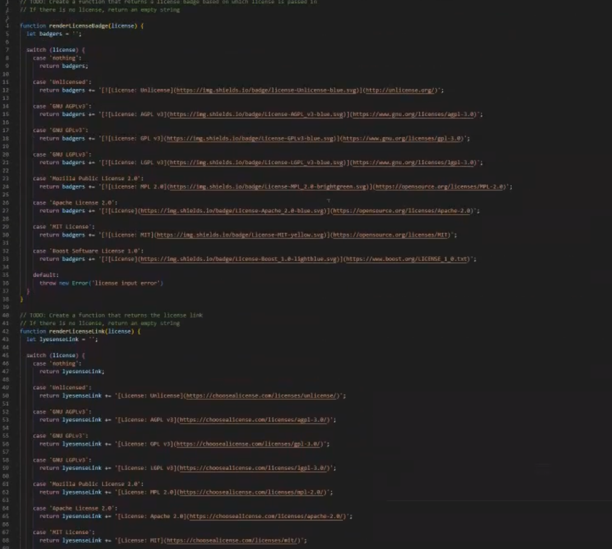

# Professional-README-Generator

 

## Description 

This application is for users to generate a professional README.md file. By using this application users will be able output a README.md file by answering the prompts for each section. 

## Table of Contents 

- [Installation](#installation) 

- [Usage](#usage) 

- [Credits](#credits) 

- [Contributing](#contributing) 

- [Tests](#tests) 

- [Questions](#questions) 

- [License](#license) 

## Installation 

In terminal node.js type npm i 

## Usage 

Open files in VScode and navigate to the index.js file. Open index.js with terminal and enter "node index.js". Follow through with prompts in terminal, entering in desired content for each section. Upon completion your generated readme will appear in the dist folder.  

Video of app flow:
https://drive.google.com/file/d/1w5xbEgdVXIIO9f3GiPSFqMorQOKkrdDd/view

## Credits 

N/A 

## License             

[License: MIT](https://choosealicense.com/licenses/mit/)  

 

     

MIT License 

## Contributing 

N/A 

## Tests 

N/A 

## Questions 

To contact me for any questions you may have please email me at armstrongnick1999@gmail.com 

My GitHub: Nick-JDA
